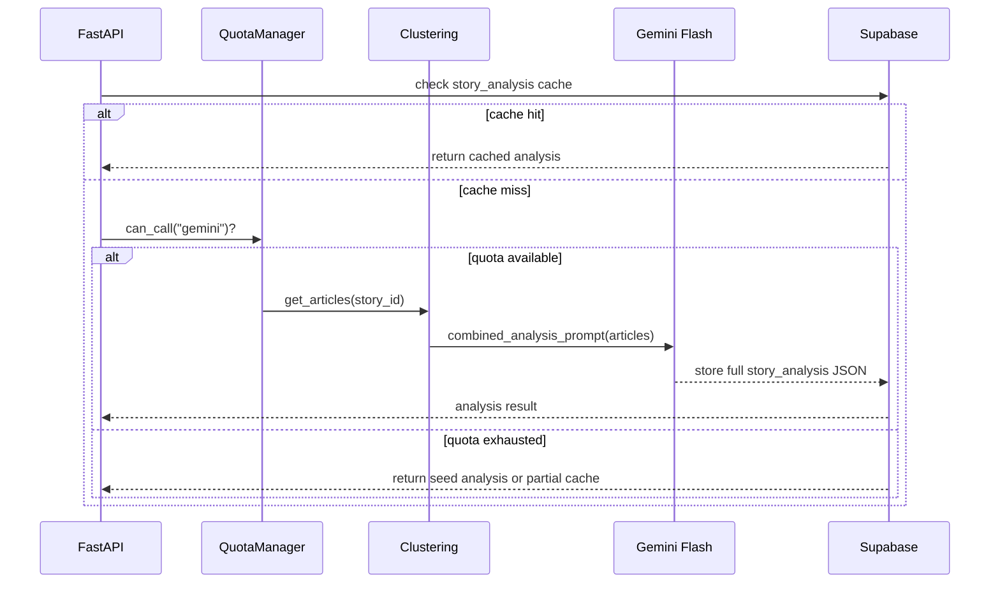

# AI_PROMPTS.md — AI Analysis Pipeline

---

## 1. Orchestrator

Single `analyze_story(story_id)` function — **one combined LLM call**, not
four separate calls, to stay comfortably within the free Gemini quota.



---

## 2. Prompt Engineering Rules

- **One prompt, all outputs** — a single JSON schema covering summary,
  comparison, bias, perspectives, and timeline in one response.
- Force JSON schema output; validate with Pydantic before writing to the DB.
- Include exactly 1 few-shot example, kept in
  `backend/prompts/combined_analysis.py`.
- Cap input: truncate each article to its first 600 tokens (5 articles ×
  600 ≈ 3,000 input tokens).
- **Never re-analyze** a story if `story_analysis.analyzed_at` already
  exists and the linked article set hasn't changed.
- Test prompts against seed data locally before burning real Gemini quota.
- Tone requirement baked into the prompt: confident, clear, non-partisan.
  Never claim an outlet is "wrong" — frame everything as transparency and
  informed choice, not adjudication.

---

## 3. Combined Output Schema

```json
{
  "balanced_summary": {
    "consensus_facts": ["Fact agreed by all sources"],
    "disputed_points": ["Point where sources diverge"],
    "neutral_summary": "Two-sentence neutral overview"
  },
  "comparison": [
    {"source": "BBC", "headline": "...", "tone": "neutral", "emphasis": "humanitarian"}
  ],
  "bias_analysis": [
    {
      "source": "Example News",
      "framing": ["security", "accountability"],
      "tone": "critical",
      "loaded_phrases": [
        {"text": "slammed the decision", "reason": "emotionally charged verb"}
      ]
    }
  ],
  "missing_perspectives": {"covered": ["government"], "missing": ["civilian impact"]},
  "timeline": [{"published_at": "2026-08-06T09:00Z", "source": "Fox", "framing_shift": "security-first"}]
}
```

**Per-field notes:**

- `balanced_summary` — separate what all sources agree happened
  (`consensus_facts`) from where they diverge (`disputed_points`), plus a
  short neutral overview.
- `comparison` — one row per source: headline, tone, and emphasis (e.g.
  economic vs. human-impact framing).
- `bias_analysis` — per-source framing labels, overall tone, and
  **quoted spans with a rationale** for each loaded phrase. The rationale is
  what makes this explainable rather than a bare score.
- `missing_perspectives` — checked against a stakeholder checklist:
  government, civilians, experts, opposition, international. Output
  `covered[]` and `missing[]`.
- `timeline` — chronological entries showing how framing shifted hour by
  hour across outlets.

---

## 4. Budget Math

| Item | Value |
|---|---|
| Gemini free tier | ~1M tokens/day, 15 RPM |
| Our daily cap | 20 story analyses/day |
| Cost per story | 1 combined call (not 4) |
| Groq fallback cap | 10 calls/day |
| Pre-analyzed demo stories | 3, cached forever for rehearsals |

20 stories × 1 call = 20 Gemini calls/day — comfortably under the free
tier. Pre-analyzing the 3 demo stories once means rehearsals never touch
the live API again.

---

## 5. Fallback Order

1. **Cache hit** on `story_analysis` → serve immediately, zero API cost.
2. **Cache miss + Gemini quota available** → single combined Gemini call.
3. **Cache miss + Gemini quota exhausted** → Groq fallback (max 10/day).
4. **All quota exhausted** → serve seed/partial cached analysis rather than
   fail the request.

This order is enforced by `quota_manager.can_call()` — see
`PROJECT_RULES.md` §1–3 for the caps themselves.

---

## 6. Development Workflow (zero API burn)

1. Hours 0–20: `API_MODE=seed` — pipeline reads from
   `data/seed/demo_stories.json`.
2. Hours 14–18: one-time `live` run to ingest + analyze 3 demo topics →
   persist to Supabase.
3. Hours 20–34: `API_MODE=rss` for integration testing (RSS ingest only, no
   new LLM calls).
4. Hour 35 demo: `seed` or `live`, depending on whether fresh live data is
   actually needed for the pitch.
5. Never re-run `analyze_story()` on the same `story_id` if
   `story_analysis` already exists for it.

## 7. Pre-Hackathon Offline Prep

Before Hour 0, one teammate runs a local script once, outside the 36-hour
clock:

- Fetch 3 topics via RSS manually.
- Run the Gemini combined-analysis prompt once per topic.
- Export the results as `supabase/seed.sql` + `backend/data/seed/demo_stories.json`.

This gives the team a fully working demo with **zero API dependency** on
demo day — see `DEMO_PLAN.md` for how this gets used on stage.
