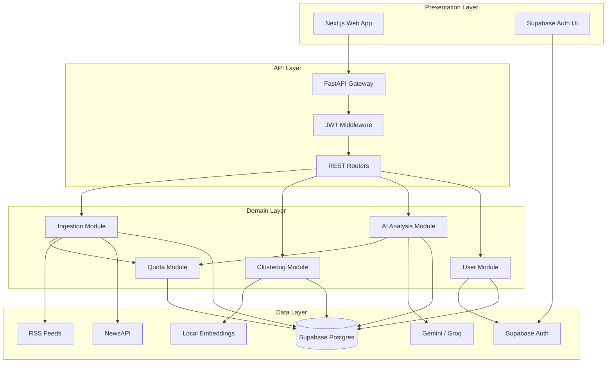
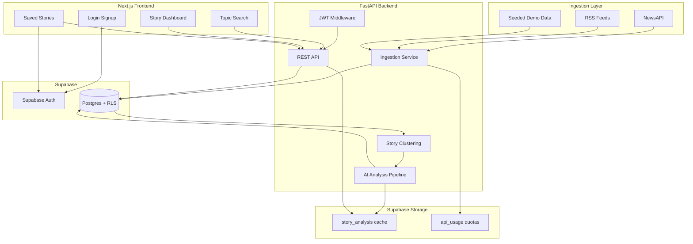
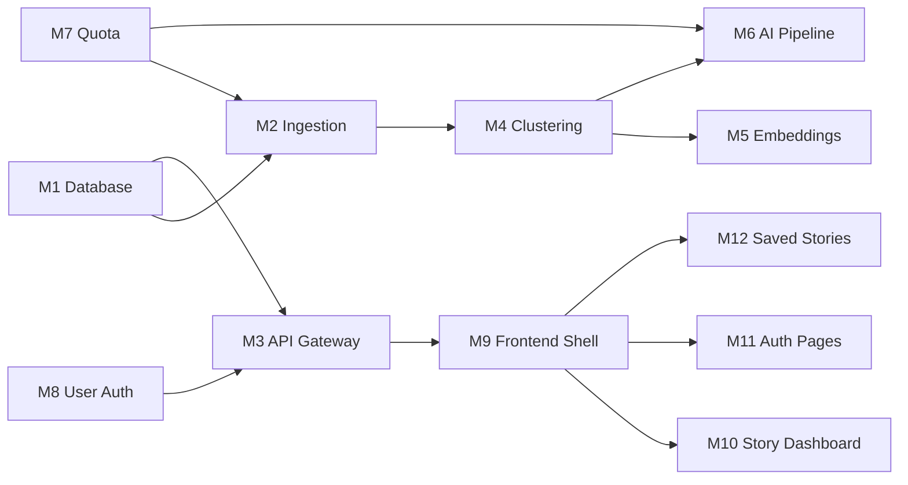

# ARCHITECTURE.md — System Design

---

## 1. Layered Architecture

Four layers, cache-first, optimized for free-tier APIs and hackathon speed.



### Layer responsibilities

| Layer | Responsibility | Key rule |
|---|---|---|
| Presentation | Search, story dashboard, auth UI, visualizations | Never calls external APIs directly — only FastAPI + Supabase Auth |
| API | Routing, JWT validation, request/response schemas | All reads from DB cache first; writes via service role |
| Domain | Business logic: ingest, cluster, analyze, quota | `API_MODE` checked before every external call |
| Data | Persistence, auth, external feeds, LLM | Supabase is single source of truth |

---

## 2. Full System Diagram



---

## 3. Core Data Flows

**Flow 1 — User views a story (hot path, zero API cost)**
```
Browser → GET /api/stories/{id} → story_analysis cache hit → JSON response → Render tabs
```

**Flow 2 — Background ingest (scheduled, RSS-only by default)**
```
Cron/BackgroundTask → quota_manager.can_call() → RSS fetch → normalize → dedup → insert articles
→ clustering.embed() → cluster stories → if new story AND quota OK → ai_pipeline.analyze()
```

**Flow 3 — User saves a story (auth-gated)**
```
Browser → Supabase session JWT → POST /api/saved-stories → verify JWT → insert saved_stories (RLS)
```

**Flow 4 — Demo / seed mode (no external calls)**
```
Browser → GET /api/stories → quota_manager reads demo_stories.json OR Supabase seed rows → response
```

---

## 4. Cross-Cutting Concerns

| Concern | Implementation | Module |
|---|---|---|
| Authentication | Supabase Auth + FastAPI JWT | M8 User |
| Authorization | RLS on profiles/saved_stories | M1 Database |
| Rate limiting | Daily counters in `api_usage` | M7 Quota |
| Caching | `story_analysis` + `api_cache` tables | M1, M6 |
| Error fallback | Seed JSON when quota/live fails | M7, M6 |
| Observability | `GET /api/quota` + structured logs | M7, M3 |

---

## 5. Deployment Topology

```
[Vercel]          [Railway/Render]         [Supabase Cloud]
  Next.js    ←→      FastAPI         ←→    Postgres + Auth
  (static)         (Python 3.11)          (pgvector, RLS)
```

---

## 6. Module Map & Dependency Graph



**Build order:**
```
M1 → M7 → M2 → M5 → M4 → M6 → M3
M1 → M8 ─────────────────────→ M3
M3 → M9 → M10 → M12
Supabase config → M11 → M12
M3 + M9 + M10 → Integration → Deploy
```

**Contract rule:** modules communicate only via defined interfaces (DB
tables, REST endpoints, or Python service functions) — no cross-module file
imports except through `services/` and `routers/`.

---

## 7. Module Registry

| ID | Module | Owner | Priority | Files / paths |
|---|---|---|---|---|
| M1 | Database & Migrations | A | P0 | `supabase/migrations/`, `supabase/seed.sql` |
| M2 | Ingestion | A | P0 | `services/ingestion.py`, `data/feeds.json` |
| M3 | API Gateway | A | P0 | `main.py`, `routers/*.py`, `models/schemas.py` |
| M4 | Clustering | A | P0 | `services/clustering.py` |
| M5 | Embeddings (local) | A | P0 | Inside `clustering.py` or `services/embeddings.py` |
| M6 | AI Analysis Pipeline | B | P0 | `services/ai_pipeline.py`, `prompts/combined_analysis.py`, `models/analysis.py` |
| M7 | Quota & API Mode | A | P0 | `services/quota_manager.py`, `routers/quota.py` |
| M8 | User Auth (backend) | A | P0 | `auth/jwt.py`, `auth/deps.py`, `routers/me.py`, `routers/saved.py` |
| M9 | Frontend Shell | C | P0 | `app/layout.tsx`, `app/page.tsx`, `components/NavBar.tsx`, `components/QuotaBadge.tsx` |
| M10 | Story Dashboard | C | P0 | `app/story/[id]/page.tsx`, `components/BiasChart.tsx`, `ComparisonGrid.tsx`, `Timeline.tsx`, `PerspectivesList.tsx` |
| M11 | Auth Pages (frontend) | C | P0 | `app/login/`, `app/signup/`, `app/auth/callback/`, `lib/supabase/` |
| M12 | Saved Stories UI | C | P1 | `app/saved/page.tsx`, `components/SaveButton.tsx` |

---

## 8. Module Specifications

### M1 — Database & Migrations
- **Inputs:** SQL migration files, seed data
- **Outputs:** Tables, RLS policies, pgvector index, profile trigger
- **Dependencies:** None (first module to build)
- **Deliverable:** `001_initial.sql` applied to Supabase; seed rows for 2 demo stories

### M2 — Ingestion
- **Inputs:** RSS feed URLs, optional NewsAPI query, `API_MODE`
- **Outputs:** Normalized `Article` rows in Supabase
- **Interface:** `ingest_rss() -> list[Article]`, `ingest_newsapi(query) -> list[Article]`
- **Dependencies:** M1, M7
- **Deliverable:** Articles from 10 RSS feeds stored; NewsAPI capped

### M3 — API Gateway
- **Inputs:** HTTP requests
- **Outputs:** JSON responses per OpenAPI spec
- **Interface:** 11 REST endpoints (see `API.md`)
- **Dependencies:** M1, M4, M6, M7, M8
- **Deliverable:** `/docs` Swagger UI working in seed mode

### M4 — Clustering
- **Inputs:** Unclustered articles with embeddings
- **Outputs:** `Story` + `story_articles` join rows
- **Interface:** `cluster_articles(threshold=0.75) -> list[Story]`
- **Dependencies:** M1, M5
- **Deliverable:** ≥1 story cluster with 5+ articles

### M5 — Embeddings (local)
- **Inputs:** Article title + lede text
- **Outputs:** 384-dim vector stored in `articles.embedding`
- **Interface:** `embed_text(text) -> vector`, `embed_batch(articles) -> None`
- **Dependencies:** M1
- **Deliverable:** Embeddings computed with zero API calls

### M6 — AI Analysis Pipeline
- **Inputs:** Story ID → linked articles
- **Outputs:** Full `story_analysis` JSON row
- **Interface:** `analyze_story(story_id) -> StoryAnalysis`
- **Dependencies:** M1, M7, combined prompt
- **Deliverable:** 1 combined Gemini call → validated JSON → cached

### M7 — Quota & API Mode
- **Inputs:** `API_MODE` env, `api_usage` table
- **Outputs:** `can_call(service) -> bool`, seed data loader
- **Interface:** Used by M2, M6 before any external call
- **Dependencies:** M1
- **Deliverable:** Blocks calls when budget exhausted; serves seed JSON

### M8 — User Auth (backend)
- **Inputs:** Supabase JWT Bearer token
- **Outputs:** `CurrentUser` object or 401
- **Interface:** `get_current_user()` FastAPI dependency
- **Dependencies:** M1, Supabase JWT secret
- **Deliverable:** Protected routes reject invalid tokens

### M9 — Frontend Shell
- **Inputs:** API responses
- **Outputs:** Home page, nav, search, quota badge
- **Dependencies:** M3 (mock → live)
- **Deliverable:** Search returns story cards from API

### M10 — Story Dashboard
- **Inputs:** `GET /api/stories/{id}` payload
- **Outputs:** 5-tab UI (Summary, Compare, Bias, Perspectives, Timeline)
- **Dependencies:** M3, M9
- **Deliverable:** All tabs render seed data correctly

### M11 — Auth Pages (frontend)
- **Inputs:** Supabase Auth SDK
- **Outputs:** Login/signup/OAuth callback, session middleware
- **Dependencies:** Supabase project config
- **Deliverable:** Google OAuth login flow complete

### M12 — Saved Stories UI
- **Inputs:** JWT session, `POST/GET /api/saved-stories`
- **Outputs:** Save button + `/saved` page
- **Dependencies:** M8, M11, M10
- **Deliverable:** Bookmark persists across refresh

---

## 9. Project Structure

```
news-transparency/
├── supabase/
│   ├── migrations/           # schema, RLS, triggers, pgvector
│   └── seed.sql              # demo stories
├── backend/
│   ├── app/
│   │   ├── main.py
│   │   ├── auth/             # JWT verification, get_current_user
│   │   ├── routers/          # stories, saved, ingest, me
│   │   ├── services/
│   │   │   ├── supabase_client.py
│   │   │   ├── quota_manager.py   # daily caps, API_MODE routing
│   │   │   ├── ingestion.py       # RSS-first, NewsAPI capped
│   │   │   ├── clustering.py      # local sentence-transformers
│   │   │   └── ai_pipeline.py     # single combined Gemini call
│   │   ├── models/           # Pydantic schemas
│   │   └── prompts/
│   │       └── combined_analysis.py  # one prompt, all outputs
│   ├── data/seed/            # demo story JSON (zero API demo)
│   └── requirements.txt
├── frontend/
│   ├── app/
│   │   ├── page.tsx
│   │   ├── login/page.tsx
│   │   ├── signup/page.tsx
│   │   ├── auth/callback/route.ts
│   │   ├── saved/page.tsx
│   │   └── story/[id]/page.tsx
│   ├── lib/supabase/         # client.ts, server.ts, middleware.ts
│   ├── middleware.ts         # session refresh
│   └── components/           # BiasChart, ComparisonGrid, Timeline, SaveButton
└── README.md
```
